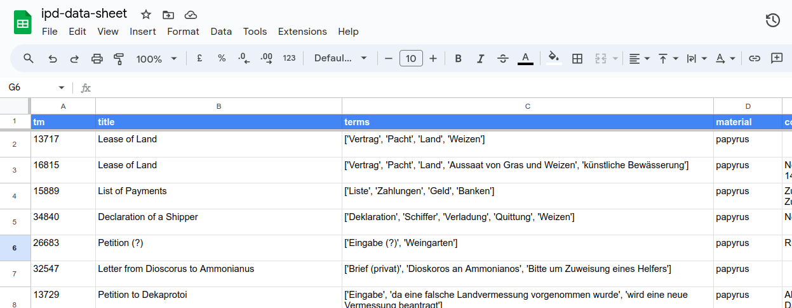

# IDP (Integrating Digital Papyrology) Data Sheet

**Script for generating a CSV sheet of the [Integrating Digital Papyrology (IDP) data](https://github.com/papyri/idp.data).**

Example: [CSV imported into Google Sheets](https://docs.google.com/spreadsheets/d/19b-uGsyhmQ7lpqvoEPA7eFzCNz8HowDbdq1PzqDaxuM/)



The Python script uses the [epidoc](https://github.com/Xennis/epidoc-parser) library for parsing the data.

## Development

Create a virtual environment, enable it and install the dependencies
```shell
python3 -m venv venv
. venv/bin/activate
pip install --requirement requirements.txt
```

First clone the repository [idp.data](https://github.com/papyri/idp.data). Next run the script
```shell
python main.py --path /path/to/idp.data
```
